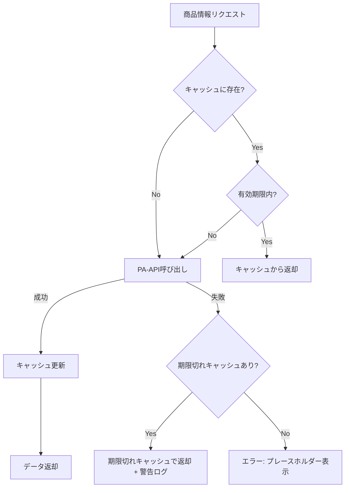

# Amazon PA-API 連携仕様書

> **IMPORTANT: PA-API 連携の実装・修正時は必ず本ドキュメントを参照すること。**
> 型定義・キャッシュ戦略・エラーハンドリング・レート制限対策はすべて本書の仕様に従う。
> 関連: [`README.md`](./README.md) / [`architecture.md`](./architecture.md) / [`component-spec.md`](./component-spec.md) / [`deal-pipeline.md`](./deal-pipeline.md)（自動記事内の ProductCard と併用時） / [`requirement.md`](./requirement.md)

## 1. 概要

Amazon Product Advertising API (PA-API) 5.0 を使用して、商品情報をビルド時に取得し、静的サイトに埋め込む。

### 前提条件

- Amazon アソシエイトプログラムへの登録済み
- PA-API アクセスキーの取得済み
- 過去30日以内に3件以上の適格販売実績がある（PA-API利用条件）

## 2. API エンドポイント

| リージョン | エンドポイント |
|------------|---------------|
| 日本 | `webservices.amazon.co.jp` |

ホスト: `webservices.amazon.co.jp`
パス: `/paapi5/{operation}`

## 3. 使用する API オペレーション

### 3.1 GetItems

ASIN を指定して商品情報を取得する。メインで使用するオペレーション。

**リクエスト:**

```typescript
interface GetItemsRequest {
  ItemIds: string[];        // ASIN配列（最大10件）
  Resources: string[];      // 取得するリソース
  PartnerTag: string;       // アソシエイトタグ
  PartnerType: "Associates";
  Marketplace: "www.amazon.co.jp";
}
```

**取得するリソース:**

```typescript
const ITEM_RESOURCES = [
  "Images.Primary.Large",
  "ItemInfo.Title",
  "ItemInfo.Features",
  "ItemInfo.ByLineInfo",
  "Offers.Listings.Price",
  "Offers.Listings.SavingBasis",
  "CustomerReviews.StarRating",
  "CustomerReviews.Count",
];
```

### 3.2 SearchItems

キーワードで商品を検索する。ランキング記事の作成時に補助的に使用。

**リクエスト:**

```typescript
interface SearchItemsRequest {
  Keywords: string;
  SearchIndex?: string;     // カテゴリ（"All", "Electronics", "Books" 等）
  ItemCount?: number;       // 取得件数（1-10、デフォルト10）
  Resources: string[];
  PartnerTag: string;
  PartnerType: "Associates";
  Marketplace: "www.amazon.co.jp";
}
```

## 4. データモデル

### 4.1 Product 型定義

```typescript
interface Product {
  asin: string;
  title: string;
  url: string;              // アフィリエイトリンク付きURL
  imageUrl: string;
  price: {
    amount: number;
    currency: string;       // "JPY"
    displayAmount: string;  // "¥1,980"
  } | null;
  originalPrice: {          // 定価（セール時の比較用）
    amount: number;
    currency: string;
    displayAmount: string;
  } | null;
  rating: {
    value: number;          // 0-5
    count: number;          // レビュー数
  } | null;
  features: string[];       // 商品特徴（箇条書き）
  brand: string | null;
  fetchedAt: string;        // ISO 8601 タイムスタンプ
}
```

## 5. キャッシュ戦略

### 5.1 キャッシュ構造

ファイルベースの JSON キャッシュを使用する。

**ファイル:** `cache/products.json`

```typescript
interface ProductCache {
  [asin: string]: {
    product: Product;
    cachedAt: string;       // ISO 8601
    expiresAt: string;      // ISO 8601
  };
}
```

### 5.2 キャッシュポリシー

| 項目 | 値 |
|------|-----|
| 有効期限 | 24時間 |
| 保存先 | `cache/products.json` |
| Git管理 | `.gitignore` に追加して管理外 |
| 更新タイミング | ビルド時に期限切れ分のみ更新 |

### 5.3 キャッシュフロー



## 6. レート制限対策

PA-API のレート制限に対応するための戦略。

| 対策 | 詳細 |
|------|------|
| リクエスト間隔 | 最低1秒のインターバル |
| バッチ処理 | GetItems は最大10件を1リクエストでまとめる |
| キャッシュ活用 | 有効なキャッシュがある場合はAPIコールしない |
| リトライ | 429エラー時は指数バックオフで最大3回リトライ |

**リトライロジック:**

```typescript
const RETRY_CONFIG = {
  maxRetries: 3,
  baseDelay: 1000,          // 1秒
  maxDelay: 10000,           // 10秒
  backoffMultiplier: 2,
};
```

## 7. 認証（AWS Signature V4）

PA-API 5.0 は AWS Signature Version 4 で署名する必要がある。

**署名に必要な情報:**

| 項目 | 値 |
|------|-----|
| Service | `ProductAdvertisingAPI` |
| Region | `us-west-2`（日本マーケットプレイスでも固定） |
| HTTP Method | `POST` |
| Content-Type | `application/json; charset=UTF-8` |

## 8. エラーハンドリング

| HTTPステータス | エラー種別 | 対応 |
|---------------|-----------|------|
| 200 | 成功 | 正常処理 |
| 400 | リクエスト不正 | ログ出力、プレースホルダー表示 |
| 401 | 認証エラー | ビルド停止、エラーメッセージ表示 |
| 429 | レート制限 | 指数バックオフでリトライ |
| 500 | サーバーエラー | リトライ → 失敗時はキャッシュフォールバック |

## 9. 環境変数

```
AMAZON_ACCESS_KEY=         # PA-APIアクセスキー（必須）
AMAZON_SECRET_KEY=         # PA-APIシークレットキー（必須）
AMAZON_ASSOCIATE_TAG=      # アソシエイトタグ（必須）
AMAZON_MARKETPLACE=        # www.amazon.co.jp（デフォルト値あり）
```

## 10. 実装上の注意点

- PA-API の利用規約で、取得した商品情報のキャッシュは24時間以内の更新が推奨されている
- 商品画像は Amazon のサーバーから直接配信する（ローカルにダウンロード保存しない）
- 価格情報には「※価格は取得時点のものです」等の注意書きを表示する
- アフィリエイトリンクには `rel="nofollow sponsored"` を付与する
- PA-API が利用できない場合のフォールバックとして、手動リンク挿入も可能な設計にする
