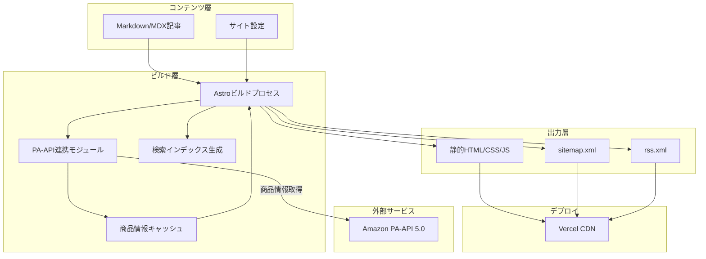
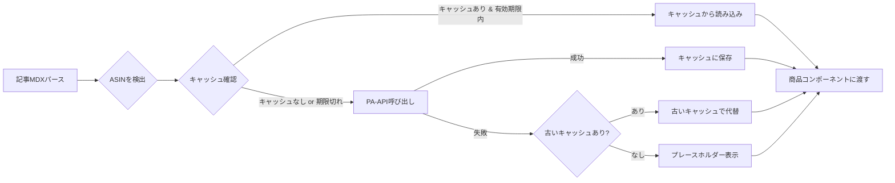
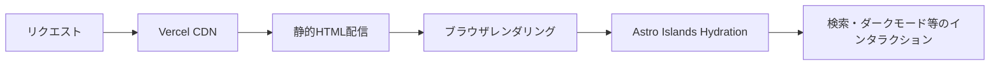

# 技術設計書 - Amazon アフィリエイトブログ

> **IMPORTANT: 実装時は必ず本ドキュメントおよび `docs/` 配下の関連ドキュメントを参照すること。**
> 技術スタック・ディレクトリ構成・モジュール設計はすべて本書に従う。
> 関連: [`README.md`](./README.md) / [`requirement.md`](./requirement.md) / [`amazon-api.md`](./amazon-api.md) / [`component-spec.md`](./component-spec.md) / [`seo-spec.md`](./seo-spec.md) / [`content-guide.md`](./content-guide.md) / [`deal-pipeline.md`](./deal-pipeline.md) / [`tasks.md`](./tasks.md)

## 1. 技術スタック

| レイヤー | 技術 | 選定理由 |
|----------|------|----------|
| フレームワーク | Astro 5.x | 静的サイト生成でSEOに強い、ビルドが高速、Markdownネイティブ対応 |
| UIコンポーネント | React 19（Astro Islands） | 必要な箇所だけインタラクティブにでき、パフォーマンスに有利 |
| スタイリング | Tailwind CSS 4.x | ユーティリティファーストで高速な開発、レスポンシブ対応が容易 |
| コンテンツ管理 | Markdown / MDX | 記事をファイルベースで管理、Gitで差分管理可能 |
| API連携 | Amazon PA-API 5.0 | 商品情報・価格・画像の自動取得 |
| 検索 | Fuse.js | 軽量なクライアントサイド全文検索 |
| デプロイ | Vercel | Astroとの相性が良い、無料枠で十分運用可能 |

## 2. システムアーキテクチャ



## 3. データフロー

### 3.1 ビルド時の商品情報取得フロー



### 3.2 ページレンダリングフロー



## 4. ディレクトリ構成

```
affiliate-blog/
├── astro.config.mjs           # Astro設定
├── tailwind.config.mjs        # Tailwind設定
├── tsconfig.json              # TypeScript設定
├── package.json
├── .env                       # 環境変数（Git管理外）
├── .env.example               # 環境変数テンプレート
├── .gitignore
│
├── docs/                      # ドキュメント
│   ├── README.md              # 索引（IMPORTANT: まずここから参照）
│   ├── requirement.md
│   ├── architecture.md
│   ├── amazon-api.md
│   ├── component-spec.md
│   ├── seo-spec.md
│   ├── content-guide.md
│   ├── deal-pipeline.md       # セール自動検知・記事生成・X 投稿
│   └── tasks.md
│
├── src/
│   ├── components/
│   │   ├── common/
│   │   │   ├── Header.astro           # ヘッダー
│   │   │   ├── Footer.astro           # フッター
│   │   │   ├── Navigation.astro       # ナビゲーション
│   │   │   ├── Breadcrumb.astro       # パンくずリスト
│   │   │   ├── Pagination.astro       # ページネーション
│   │   │   └── ShareButtons.astro     # ソーシャルシェア
│   │   ├── product/
│   │   │   ├── ProductCard.astro      # 商品カード
│   │   │   ├── CompareTable.astro     # 比較テーブル
│   │   │   └── RankingList.astro      # ランキング表示
│   │   ├── blog/
│   │   │   ├── ArticleCard.astro      # 記事カード（一覧用）
│   │   │   ├── ArticleMeta.astro      # 記事メタ情報
│   │   │   ├── RelatedPosts.astro     # 関連記事
│   │   │   └── TableOfContents.astro  # 目次
│   │   └── interactive/
│   │       ├── SearchBox.tsx          # 検索UI（React）
│   │       └── DarkModeToggle.tsx     # ダークモード切替（React）
│   │
│   ├── layouts/
│   │   ├── BaseLayout.astro           # 共通ベースレイアウト
│   │   └── BlogLayout.astro           # 記事用レイアウト
│   │
│   ├── pages/
│   │   ├── index.astro                # トップページ
│   │   ├── blog/[...slug].astro       # 記事詳細
│   │   ├── category/[name].astro      # カテゴリ別一覧
│   │   ├── tag/[name].astro           # タグ別一覧
│   │   ├── about.astro                # サイト概要
│   │   ├── privacy.astro              # プライバシーポリシー
│   │   └── rss.xml.ts                 # RSSフィード
│   │
│   ├── content/
│   │   ├── config.ts                  # コンテンツコレクション定義
│   │   └── blog/                      # 記事Markdownファイル
│   │       └── sample-post.mdx        # サンプル記事
│   │
│   ├── lib/
│   │   ├── amazon-api.ts              # PA-API連携ロジック
│   │   ├── cache.ts                   # 商品情報キャッシュ管理
│   │   ├── search.ts                  # 検索インデックス生成
│   │   └── utils.ts                   # ユーティリティ関数
│   │
│   ├── config/
│   │   └── site.ts                    # サイト全体の設定値
│   │
│   └── styles/
│       └── global.css                 # グローバルスタイル（Tailwind読み込み）
│
├── public/
│   ├── favicon.svg
│   ├── robots.txt
│   └── images/                        # 静的画像
│
└── cache/
    └── products.json                  # 商品情報キャッシュ（Git管理外）
```

## 5. 主要モジュール設計

### 5.1 `src/lib/amazon-api.ts`

PA-API 5.0 との通信を担当。詳細は `amazon-api.md` を参照。

- `getProductByAsin(asin: string): Promise<Product>` - 単一商品の取得
- `getProductsByAsins(asins: string[]): Promise<Product[]>` - 複数商品の一括取得
- `searchProducts(keywords: string, category?: string): Promise<Product[]>` - キーワード検索

### 5.2 `src/lib/cache.ts`

商品情報のキャッシュ管理。

- `getCachedProduct(asin: string): Product | null` - キャッシュから取得
- `setCachedProduct(asin: string, product: Product): void` - キャッシュに保存
- `isCacheValid(asin: string): boolean` - キャッシュの有効期限チェック
- `clearExpiredCache(): void` - 期限切れキャッシュの削除

### 5.3 `src/config/site.ts`

サイト全体の定数・設定値を一元管理。

- サイト名、URL、説明文
- カテゴリ定義
- ナビゲーションメニュー定義
- SNSアカウント情報

### 5.4 セール自動投稿パイプライン（外部リポジトリ）

日次の価格監視・MDX 自動生成・X 投稿は、ブログ本体とは別の Python リポジトリ（`Desktop/スクレイピング`）で実行する。

> **IMPORTANT:** フロー・設定・GitHub Actions の詳細は [`deal-pipeline.md`](./deal-pipeline.md) を参照すること。

## 6. 環境変数

```
# Amazon PA-API
AMAZON_ACCESS_KEY=         # PA-APIアクセスキー
AMAZON_SECRET_KEY=         # PA-APIシークレットキー
AMAZON_ASSOCIATE_TAG=      # アソシエイトタグ
AMAZON_MARKETPLACE=        # マーケットプレイス（www.amazon.co.jp）

# サイト設定
SITE_URL=                  # 本番サイトURL
```
