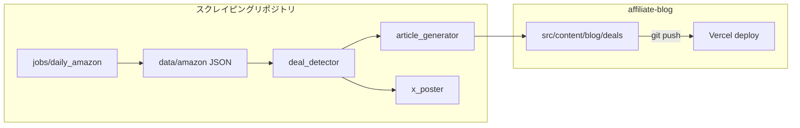

# セール自動検知・記事生成・X 投稿パイプライン仕様

> **IMPORTANT: 日次スクレイピング連携・セール記事の自動生成・X 投稿を実装・変更する際は必ず本ドキュメントを参照すること。**
> ブログ本体（Astro）は静的サイトであり、本パイプラインは **別リポジトリの Python ジョブ** から MDX を書き込み、Git で公開する。
>
> 関連: [`requirement.md`](./requirement.md)（2.6 機能要件） / [`content-guide.md`](./content-guide.md)（自動生成 MDX の体裁） / [`tasks.md`](./tasks.md)（Phase 8） / [`architecture.md`](./architecture.md)

## 1. 概要

| 項目 | 内容 |
|------|------|
| 目的 | 価格が下がった・割引が大きい商品を検知し、**ブログ記事**と**X 投稿**を自動化する |
| データソース | スクレイピングプロジェクトの `data/amazon/{日付}-products.json` |
| 実行場所 | `C:\Users\taimai\Desktop\スクレイピング` の `jobs/daily_amazon.py` および GitHub Actions |
| ブログ側 | `affiliate-blog/src/content/blog/deals/{日付}-amazon-deals.mdx` に MDX を出力 |

## 2. システム境界



## 3. セール検知ロジック

- **割引率**: `discount_percent >= min_discount_percent`（デフォルト 20%）
- **価格下落**: 前日 JSON と ASIN で突合し、`(prev - current) / prev * 100 >= min_price_drop_percent`（デフォルト 5%）
- 上記は **OR**（どちらか満たせば対象）
- 設定キーは `config.yaml` の `deals` セクション（スクレイピング側）

## 4. 記事自動生成（MDX）

### 4.1 配置・URL

- パス: `affiliate-blog/src/content/blog/deals/{YYYY-MM-DD}-amazon-deals.mdx`
- URL: `/blog/deals/{YYYY-MM-DD}-amazon-deals`

### 4.2 フロントマター（必須フィールド）

[`content-guide.md`](./content-guide.md) のスキーマに合わせる。

| フィールド | 推奨値 |
|-----------|--------|
| `title` | `【自動更新】Amazon セールピックアップ（YYYY-MM-DD）` 等 |
| `description` | 件数・カテゴリを要約した 1〜2 文 |
| `category` | サイトのカテゴリ slug（例: `life`）— `src/config/site.ts` の `CATEGORIES` と一致させる |
| `tags` | `Amazon`, `セール`, `自動生成` 等 |
| `publishedAt` | 当日日付（ISO 日付） |
| `draft` | レビュー運用なら `true`、即公開なら `false` |

### 4.3 本文

- アフィリエイトである旨の一文（景品表示法・開示）
- カテゴリ（検索キーワード）ごとに見出し + 箇条書きまたは表
- 各商品: 名前・現在価格・割引理由・**アソシエイト付き URL**（`tag=アソシエイトID`）
- 可能なら `<ProductCard asin="..." />` を併記（ビルド時に PA-API で詳細取得）

## 5. X（Twitter）投稿

- **API**: X API v2 + OAuth 1.0a（例: `tweepy`）
- **Secrets**: `X_API_KEY`, `X_API_SECRET`, `X_ACCESS_TOKEN`, `X_ACCESS_SECRET`（GitHub Actions では Repository Secrets）
- **内容**: セール上位 N 件（デフォルト 5）+ ブログ記事 URL + 必要ならセールハブの短縮リンク
- **制限**: Free プランは月 1,500 投稿上限など — 要件は [`requirement.md`](./requirement.md) 6 章参照

## 6. 設定（スクレイピング `config.yaml`）

実装済みの `deals` セクション（環境に合わせて変更）:

```yaml
deals:
  enabled: true
  min_discount_percent: 20
  min_price_drop_percent: 5
  max_items_per_article: 20
  max_items_per_tweet: 5
  blog_repo_path: "../アフィリエイト/affiliate-blog"
  associate_tag: ""
  site_url: "https://amazon-affiliate-blog.vercel.app"
  article_category_slug: "life"
  article_draft: false
  x_post_enabled: true
```

環境変数上書き（`scraper/config.py`）: `BLOG_REPO_PATH`, `SITE_URL`, `DEALS_ENABLED`, `X_POST_ENABLED`, `AMAZON_ASSOCIATE_TAG`。スクレイピング側 `.env.example` も参照。

## 7. GitHub Actions（スクレイピング側）

ワークフロー: `スクレイピング/.github/workflows/amazon_daily.yml`

| Secret | 用途 |
|--------|------|
| `BLOG_PUSH_TOKEN` | **任意**。設定時のみ `amazon-affiliate-blog` を `affiliate-blog/` に checkout し、ジョブ後に `src/content/blog/deals/` を push |
| `SITE_URL` | **任意**。ツイート内記事 URL（未設定時は `config.yaml` の `site_url`） |
| `AMAZON_ASSOCIATE_TAG` | **任意**。リンクの `tag` パラメータ |
| `X_API_KEY`, `X_API_SECRET`, `X_ACCESS_TOKEN`, `X_ACCESS_SECRET` | **任意**。未設定時は X 投稿をスキップ |

ジョブでは `BLOG_REPO_PATH=$GITHUB_WORKSPACE/affiliate-blog` を渡す。`BLOG_PUSH_TOKEN` が空のときはブログを checkout しないため、CI 上では MDX 生成は行われない（ローカル `blog_repo_path` も Linux ランナーでは無効なことが多い）。

**注意:** ワークフローの `repository:` は `Rakki888/amazon-affiliate-blog` 固定。別リポジトリの場合は YAML を編集すること。

### 7.1 実装ファイル（スクレイピング）

| ファイル | 役割 |
|---------|------|
| `jobs/deal_detector.py` | 割引率・前日 JSON 比較でセール抽出 |
| `jobs/article_generator.py` | MDX 生成・ブログパス解決 |
| `jobs/x_poster.py` | tweepy で X 投稿 |
| `jobs/daily_amazon.py` | パイプライン統合 |

## 8. 法務・ポリシー

- Amazon アソシエイト・オペレーティングアグリーメントおよびブランドガイドラインを遵守
- 自動生成記事でも **広告・PR であることが分かる表示** を必ず含める（[`content-guide.md`](./content-guide.md) / サイトの `privacy` ページと整合）

## 9. 変更履歴メモ

- 本仕様は [`requirement.md`](./requirement.md) の **2.6** および **Phase 8** と同期して更新すること。
